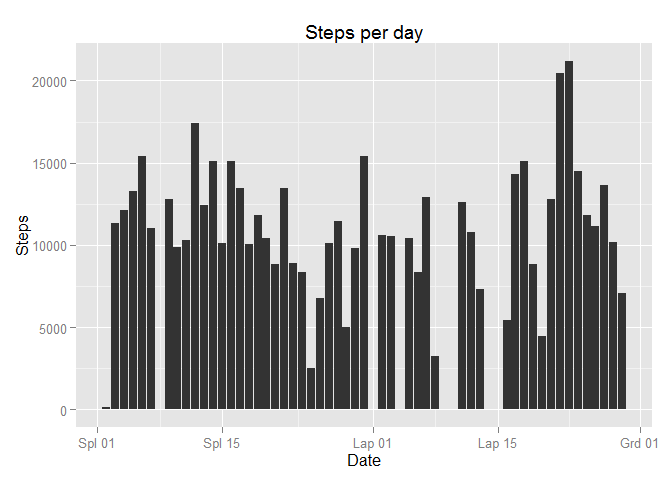
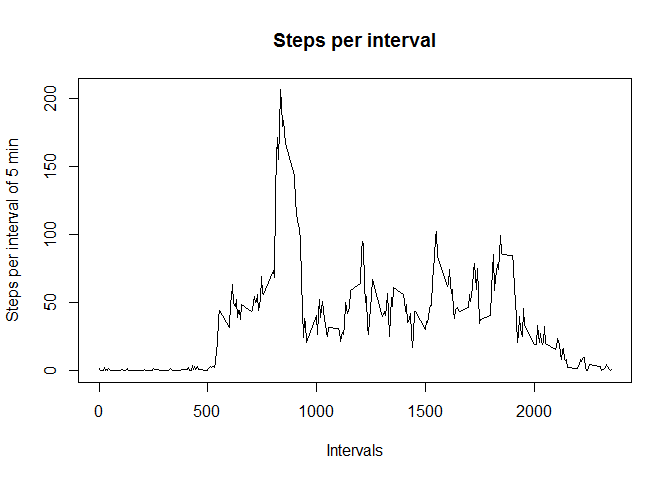
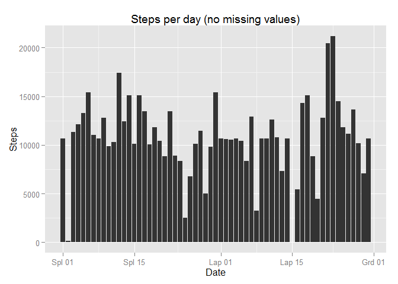
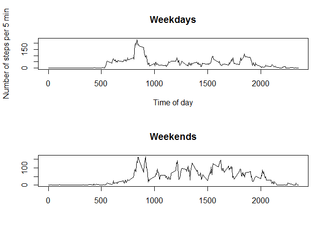

# Reproducible Research: Peer Assessment 1


```
## 
## Attaching package: 'dplyr'
## 
## The following objects are masked from 'package:plyr':
## 
##     arrange, count, desc, failwith, id, mutate, rename, summarise,
##     summarize
## 
## The following object is masked from 'package:stats':
## 
##     filter
## 
## The following objects are masked from 'package:base':
## 
##     intersect, setdiff, setequal, union
```

## Loading and preprocessing the data

```r
zip <- unz(description="./activity.zip",filename="activity.csv")
dtable <- read.csv(zip)
#change class of column date
dtable$date <- as.Date(dtable$date)
```

## What is mean total number of steps taken per day?

```r
sumsperday <- ddply(dtable,"date",summarize,stepsum=sum(steps))

ggplot(sumsperday, aes(x=date, y=stepsum))+
                                        geom_histogram(stat="identity")+
                                        labs(title="Steps per day",x="Date",y="Steps")
```

 

```r
mn <- mean(sumsperday$stepsum,na.rm=TRUE)
md <- median(sumsperday$stepsum,na.rm=TRUE)
```
Mean number of steps per day: 10766.19, median number of steps per day: 10765

## What is the average daily activity pattern?


```r
dfbyint <- ddply(dtable,"interval",summarize,stepsMean=mean(steps,na.rm=TRUE))
plot(dfbyint$interval,dfbyint$stepsMean,type="l", xlab="Intervals", ylab="Steps per interval of 5 min", main="Steps per interval")
```

 

```r
#interval with largest number of steps
dfbyint_srtsteps<- arrange(dfbyint,desc(stepsMean))
mxint<-dfbyint_srtsteps[1,"interval"]
mxsteps<-dfbyint_srtsteps[1,"stepsMean"]
```

Maximum number of steps per 5 minutes occur at interval 835, average number of steps at that interval is 206.17

## Imputing missing values

```r
cntmissing<-nrow(dtable[!complete.cases(dtable),])

#strategy to set missing values for 'steps': average for that interval. 
# will merge 2 datasets (main and averages per interval); then set missing steps value to average
dfnomissing<-merge(dtable,dfbyint,by="interval")
missingind<-which(is.na(dfnomissing$steps))
dfnomissing$steps[missingind]<- as.integer(dfnomissing$stepsMean[missingind])
dfnomissing$stepsMean<-NULL

#similar histogram of total number of steps per day
dfnomissingsum <- ddply(dfnomissing,"date",summarize,stepsum=sum(steps))
ggplot(dfnomissingsum, aes(x=date, y=stepsum))+
                                            geom_histogram(stat="identity")+
                                            labs(title="Steps per day (no missing values)",x="Date",y="Steps")
```

 

```r
#calc mean and median of total number of steps per day
mnnomissing <- mean(dfnomissingsum$stepsum)
mdnomissing <- median(dfnomissingsum$stepsum)
```
  
Number of rows with missing values is 2304  
Mean of total number of steps per day is 10749.77 (with missing values it was 10766.19)  
Median of total number of steps per day is 10641 (with missing values it was 10765)  

## Are there differences in activity patterns between weekdays and weekends?

```r
#first add a column indicating if it is a weekend or weekday
wknd<-which(weekdays(dfnomissing$date)=="sekmadienis" | weekdays(dfnomissing$date)=="šeštadienis")
wd<-which(weekdays(dfnomissing$date)!="sekmadienis" & weekdays(dfnomissing$date)!="šeštadienis")
dfnomissing$wdwknd <-as.factor(x=c("weekend","weekday"))
dfnomissing$wdwknd[wd]<-"weekday"
dfnomissing$wdwknd[wknd]<-"weekend"

#calculate averages per interval, separately for weekday days and weekends
df5meanbyint_wd <- ddply(dfnomissing[dfnomissing$wdwknd=="weekday",],"interval",summarize,stepsMean=mean(steps))
df5meanbyint_wknd <- ddply(dfnomissing[dfnomissing$wdwknd=="weekend",],"interval",summarize,stepsMean=mean(steps))

par(mfrow=c(2,1))
plot(df5meanbyint_wd$interval,df5meanbyint_wd$stepsMean,type="l",  
                                                                xlab="Time of day", 
                                                                ylab="Number of steps per 5 min",
                                                                main="Weekdays")
plot(df5meanbyint_wknd$interval,df5meanbyint_wknd$stepsMean,type="l",  
                                                                xlab="", 
                                                                ylab="",
                                                                main="Weekends")
```

 

```r
par(mfrow=c(1,1))
```


